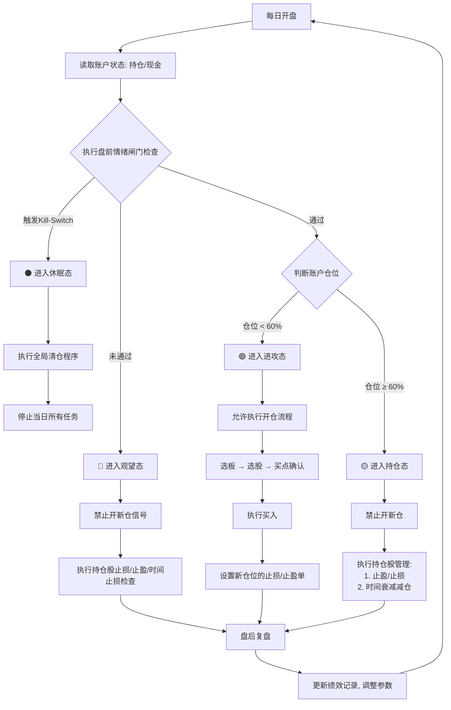

# SectorPulse 策略蓝图（准二线 · 闭环系统版 v3.1）

## 一、策略核心：状态机驱动（State Machine）

策略不再是线性流程，而是根据 `市场情绪` 和 `账户状态` 共同决定所处的**状态**，每个状态有截然不同的操作优先级。

### 系统状态定义

| 状态           | 市场情绪条件    | 账户仓位条件 | 操作核心                   |
| :-------------| :---------------| :-------- | :-------------------------- |
| **🟢 进攻态** | 情绪闸门全部通过 | 仓位 < 60% | **优先开新仓**，寻找新机会    |
| **🟡 持仓态** | 情绪闸门全部通过 | 仓位 ≥ 60% | **优先管理持仓**，止盈止损    |
| **🔴 观望态** | 情绪闸门未通过   | 仓位 ≤ 30% | **禁止开新仓**，仅持有或卖出  |
| **⚫ 休眠态** | 触发Kill-Switch | 任意仓位   | **无条件清仓**，停止一切操作  |

---

## 二、全局每日操作流程（决策闭环）

### 盘前情绪闸门（口径与阈值）

> 目的：以**可日更、盘中可判**的替代口径（Alt-Flow）替换历史上的 **北向净流** 判断，降低数据依赖与维护成本。

**判定口径（全部为布尔/阈值判断，任一为否即判定闸门未通过）：**
- **涨停家数**：不低于策略基线阈值（避免无序下跌期误开新仓）。
- **波动分位**：沪深主板或 HS300 近 30D 年化波动的**滚动分位**低于风险阈值（例：`< 0.85`）。
- **上证指数位置**：收盘价或当日实时价在 **MA20** 上方（弱趋势下不追进）。
- **极值情绪（盘中）**：**涨跌停比**未触发极端阈值（如 `< 0.5` 判为 Risk-Off）。
- **拥挤度（盘中）**：**成交额集中度**（如前 20 个股成交额占比）不处于高位且指数下跌的组合区间。

**说明：**
- **上一交易日“两融净买入/净偿还”**仅作为**日终锚点**参与**次日计划**的背景判断，不参与当日盘中闸门的即时开/停。

---

## 三、各状态下的详细操作清单

### 🟢 进攻态（市场好 & 有现金）
- **目标**：在风险可控前提下寻找新开仓机会。  
- **选股漏斗**：按 V2.0 流程筛选 1–5 只候选股。  
- **买点确认**：在 **10:00** 或 **14:00** 两个窗口检查候选股是否满足微结构买点。  
- **执行买入**：
  - 单股首仓为总资金的 **10%**；
  - 买入后：a) 单股仓位 ≤ **20%**，b) 总仓位 ≤ **60%**。  
- **预设风控（条件单）**：
  - 止损：**−4%**；
  - 止盈 1：**+8%**（减半）；
  - 止盈 2：**+15%**（清仓）。

### 🟡 持仓态（市场好 & 现金不足）
- **目标**：让利润奔跑，同时严密防护，防止收益回吐。  
- **禁止**任何新开仓。  
- **持仓管理**：
  - 严格执行预设止盈/止损；
  - **时间衰减**：T+3 观察、T+5 清仓；
  - **板块持续性**：若持仓股所属板块已退出“Top3”，提高警惕，必要时提前止盈。

### 🔴 观望态（市场差 & 有现金）
- **目标**：保护本金，规避风险，等待下一次机会。  
- **绝对禁止**新开仓。  
- **处理现有持仓**：
  - 触发 **−4%** 止损即卖出；
  - **激进止盈**：浮盈回撤 > **20%** 则卖出，锁定利润。  
- **可不操作**：若持仓无变化，可不动作。

### ⚫ 休眠态（系统性风险）
- **目标**：系统生存第一。  
- **无条件清仓**：卖出所有持仓，转为现金；  
- 停止所有策略相关自动化，进入**人工复盘**模式；  
- **重启条件**：连续 **3 个交易日**情绪闸门通过，且**月度回撤**修复至 **−3%** 以内，方可手动重启。

---

## 四、关键支撑模块（代码实现要点）

### 账户状态获取（Account State）
- `get_account_status()`：每日开盘前运行，从券商 API/交易软件获取：
  - 当前总资产 `total_asset`
  - 当前总市值 `total_market_value`
  - 当前现金 `available_cash`
  - 计算仓位比率：`position_ratio = total_market_value / total_asset`

### 全局风控检查（Global Risk Check）
- `check_kill_switch()`：独立函数，使用**替代口径（Alt-Flow）**与波动/结构信号的**组合分级**识别系统性风险。

**触发条件（满足任一，即触发对应级别）：**
- **L1（风险收缩）**
  - **两融净偿还** ≥ L1 阈值（单位：亿；见策略配置）
  - **涨跌停比** < L1 极值阈值（盘中极端情绪）
  - **成交额集中度**高位且**指数当日下跌**
- **L2（系统风险）**
  - **两融净偿还** ≥ L2 阈值
  - **涨跌停比** < L2 极值阈值
  - **集中度高位 + 指数显著下跌**的更严组合
- **波动分位保护（独立“或”条件）**
  - 近 30D 年化波动**分位 ≥ 0.90** 触发 L2
  - **分位 ≥ 0.85** 触发 L1

**动作：**
- 触发 **L1**：暂停新单、临时下调总仓上限（如 **60% → 30%**），仅做持仓管理。  
- 触发 **L2**：无条件清仓，进入 **⚫ 休眠态**，停止当日所有自动化任务。

**重启条件：**
- 连续 **3 个交易日**闸门通过，且**月度回撤**修复至配置阈值（例：`>-3%`），方可手动重启。

### 持仓管理器（Position Manager）
- `check_holding_stocks()`：逐一检查持仓的：
  - 盈亏比例 `PnL_ratio`
  - 持仓天数 `holding_days`
  - 所属板块是否仍在强势列表

### 策略状态机（Strategy State Machine）
- 根据 **市场情绪** 与 **position_ratio** 输出当前状态 `{进攻, 持仓, 观望, 休眠}`，后续流程按状态分支执行。

---

## 五、术语与数据口径

- **Alt-Flow（替代口径）**：  
  以**两融净买入/净偿还（EOD）**为日终锚点，以**涨跌停比、成交额集中度（盘中）**为极值情绪与拥挤度代理，合在一起判断**市场内外部资金情绪的状态**。  
  - **用途区分**：盘中口径用于**闸门 / KS 即时判定**；日终口径用于**次日计划与复盘**。  
  - **定位声明**：Alt-Flow 不是“外资净流”的影子，不追求一一映射，而是在更低成本下提供**等价的风控与节奏信息**。

---

## 六、总结（V3.0 原文保留）

1. **闭环决策**：流程始于并终于账户状态，形成完整闭环，解决了原流程的致命漏洞。  
2. **状态驱动**：引入明确的状态机，不同状态下操作优先级一目了然，杜绝了“该干嘛不该干嘛”的困惑。  
3. **风险分级**：将“观望”和“休眠”状态严格区分，前者是主动风险控制，后者是应对系统性风险的终极手段。  
4. **实操性增强**：明确了每个状态下的具体操作清单（To-Do List），并给出了代码实现的关键函数指引。

> 此版本才是一个真正可投入实战的、健壮的交易系统框架。

---

## 七、总结（V3.1 新增）

1. **口径升级为 Alt-Flow**：以“两融净偿还（日终）+ 涨跌停比 / 成交额集中度（盘中）”组合替换历史“北向净流”触发，**保持闸门与 KS 的判定力**，同时大幅降低数据维护成本。  
2. **一致性与可解释性**：在**术语与数据口径**中明确 Alt-Flow 的组成与用途区分（盘中 vs 日终），确保回放与复盘时可追溯。  
3. **风控分级更稳健**：Kill-Switch 改为“**资金链路（两融）+ 情绪极值（涨跌停比）+ 结构拥挤（集中度）+ 波动分位**”的**多条件独立 OR**，避免单一口径失效导致误判。  
4. **文档与流程统一**：标题层级、列表缩进、与“盘前情绪闸门”小节风格已统一；保留 V3.0 结尾总结，并新增本版总结，便于版本迭代对照。

---

