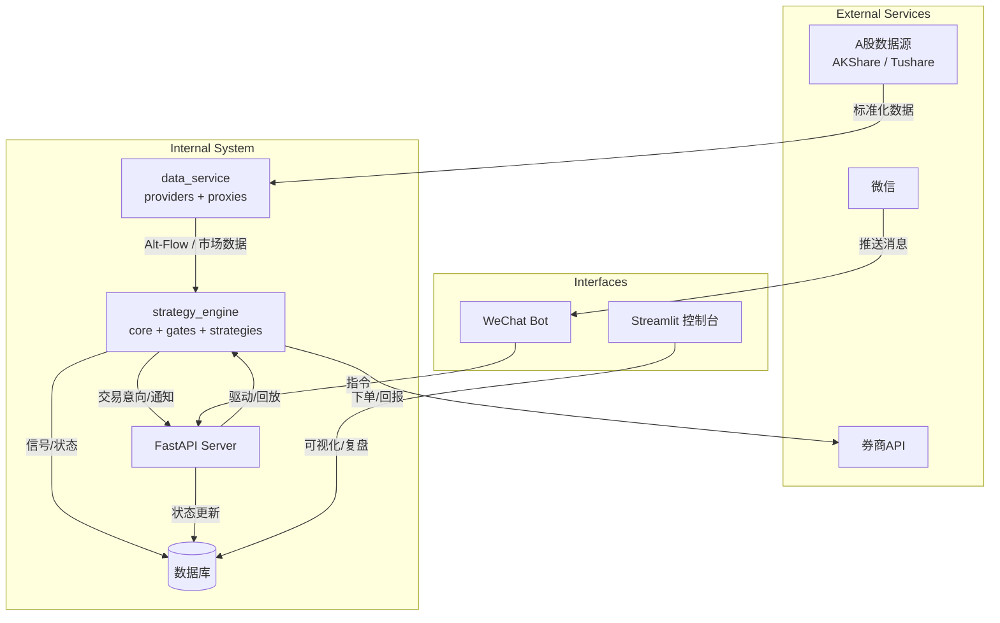

# 准二线量化交易系统 - 项目开发文档 (v1.2)

> 本版在 v1.1 的基础上，对齐《SectorPulse 策略蓝图 v3.1》，将“北向资金”全面替换为**Alt-Flow（替代口径）**：以**两融净买入/净偿还（EOD）**为日终锚点，配合**盘中极值情绪（涨跌停比）**与**结构拥挤（成交额集中度）**作为即时闸门/KS信号。并同步调整配置示例、目录结构与数据库字段命名，以降低实现复杂度与维护成本。

## 版本修订记录

| 版本号 | 修订日期 | 修订内容 | 修订人 |
|---|---|---|---|
| v1.0 | 2024-09-07 | 初始版本，确立核心架构与模块划分 | DeepSeek chat |
| v1.1 | 2024-09-07 | **关键补丁**：1) 状态机定义与迟滞；2) 分钟数据降级；3) 扩展数据库模型（4表）；4) 调度时区与时间窗约束；5) 依赖版本锁定 | DeepSeek chat |
| v1.2 | 2025-09-10 | **口径迁移**：对齐蓝图 v3.1，将“北向”改为 **Alt-Flow**；新增 `data_service/proxies` 聚合器；配置与示例键全面重命名；`StateSnapshot.northbound_flow` 改为 `flow_proxy`；事件命名改为 `altflow/*`；补充迁移指南与 DoD 对齐 | GPT5.0 |

> v1.2 参考来源：v1.1 项目开发文档基线与结构说明。 [cite: 1]

## 1. 项目概述

**1.1 项目简介** 一个基于**状态机驱动**的、面向 A 股短周期交易的半自动化量化交易系统。系统遵循“准二线策略”：由**情绪闸门**控制开仓条件，在最强板块中挑选**强度 3–5 名**的个股进行交易，并通过**多层风控（Kill-Switch + 迟滞）**管理风险。 [cite: 1]

**1.2 核心特性（与 v1.1 的差异点加粗）**
- 状态机驱动：根据市场情绪与账户状态自动切换运行模式（进攻/持仓/观望/休眠），内置迟滞逻辑防抖。 [cite: 1]
- 策略与显示分离：策略引擎模块化，支持热插拔与 A/B。 [cite: 2]
- 数据抽象层：统一接口，支持多数据源与分钟数据**降级**。 [cite: 2]
- 状态持久化：账户、持仓、信号、快照全量持久化，**可恢复**。 [cite: 2]
- **Alt-Flow 口径**：以“两融净偿还（日终）+ 涨跌停比/成交额集中度（盘中）”替代历史“北向净流”在闸门与 KS 中的角色（一致性由迟滞与分级风控保证）。 [cite: 2]
- 交互式操作（可选）：微信推送/指令（计划保留）。 [cite: 2]

**1.3 技术栈**
- 语言：Python 3.10.*（强制）
- 数据获取：Akshare、Tushare
- 数据存储：SQLite（开发）/ PostgreSQL（生产）
- Web：FastAPI（API）、Streamlit（Dashboard）
- 调度：APScheduler（Asia/Shanghai）
- ORM：SQLModel、Pydantic v2
- 消息推送（可选）：Server酱 / PushPlus
- [cite_start]依赖：`requirements.txt` 严格版本锁定 [cite: 2]

## 2. 系统架构

### 2.1 高层架构图（对齐 v3.1）

### 2.2 核心模块说明
数据服务层（data_service）：采集并清洗市场数据；在 providers/ 中实现两融、涨跌停池、成交额集中度、ETF 申赎、龙虎榜等；在 proxies/ 中**聚合 Alt-Flow（盘中/EOD 双口径）**输出给策略层；分钟数据缺失时提供降级结果与原因标记。 

策略引擎层（strategy_engine）：加载策略逻辑与状态机（含迟滞）；在 gates/ 中读取 Alt-Flow 与波动/趋势条件执行情绪闸门与 Kill-Switch；在 strategies/ 中执行选板→选股→买点确认→OrderIntent。 

API 服务层（api）：对内通信与对外交互（如微信指令）；统一回放/审计入口。 

持久化层（models/DB）：账户/持仓/交易、信号、意向、状态快照、事件日志七表；字段命名对齐 Alt-Flow。 

交互层（web_dashboard/wechat）：最小可视化与推送通道。 

## 3. 目录结构（v1.2）
SectorPulse/
├── config/
│   ├── base.yaml
│   ├── strategy_core.yaml
│   ├── dev.override.yaml
│   └── loader.py                  # 合并/归一/校验（去 northbound 硬编码，支持 Alt-Flow 键）
├── data_service/
│   ├── collector.py               # 统一数据接口（含降级标记）
│   ├── models.py
│   ├── storage.py
│   └── providers/
│       ├── margin_provider.py     # 两融：净买入/净偿还/余额
│       ├── limitpool_provider.py  # 涨跌停池与涨跌停比
│       ├── concentration_provider.py # 成交额集中度
│       ├── etf_provider.py        # ETF 申赎净额（宽基/中小盘/主题）
│       └── lhb_provider.py        # 龙虎榜净买额
│   └── proxies/
│       └── altflow_proxy.py       # 聚合 Alt-Flow（intraday / EOD）
├── strategy_engine/
│   ├── core.py                    # 状态机（迟滞）
│   ├── gates/                     # 闸门与 Kill-Switch 读取 Alt-Flow
│   ├── killswitch/
│       └── killswitch.py
│   └── strategies/
│       └── sector_pulse_v3.py
├── api/
│   ├── main.py
│   └── routers/
│       ├── wechat.py              # 可选
│       └── signals.py
├── web_dashboard/
│   └── app.py
├── services/
│   ├── account_service.py
│   ├── position_service.py
│   └── wechat_service.py          # 可选
├── models/
│   ├── database.py                # 七表（StateSnapshot.flow_proxy 等）
│   └── pydantic_models.py
├── utils/
│   ├── scheduler.py               # Asia/Shanghai；窗口 ["10:00","14:00"]
│   ├── logger.py
│   └── helpers.py
└── main.py

注：目录中新增 data_service/proxies 与 strategy_engine/gates 两个承接 Alt-Flow 的落点；其余结构与 v1.1 保持一致。 

## 4. 核心流程（与 v3.1 一致）
### 4.1 启动与状态恢复（sequence）
代码段

    participant M as main.py
    participant DB as Database
    participant SE as Strategy Engine
    participant DS as Data Service

    M->>DB: 初始化数据库连接
    M->>DB: 读取 Account / Positions / StateSnapshot
    M->>DS: 初始化数据服务
    M->>SE: 初始化策略引擎（注入已恢复的状态）
    SE-->>M: 状态恢复完毕
    M->>SE: 启动策略主循环

### 4.2 盘中决策循环（flowchart）

代码段

    A[定时唤醒（10:00/14:00）] --> B{情绪闸门检查 (Alt-Flow + 波动 + MA20)};
    B -- 未通过 --> C[切换至 观望/休眠];
    B -- 通过 --> D{状态判断（迟滞）};

    D -- 进攻态 --> E[选板 → 选股];
    E --> F[买点确认（含降级判断）];
    F --> G{{买点可执行?}};
    G -- 是 --> H[生成买入信号 并落库];
    G -- 否 --> I[记录不可执行原因];
    D -- 持仓态 --> K[检查持仓股];
    K --> L{{触发风控?}};
    L -- 是 --> M[生成卖出信号];
    L -- 否 --> N[等待];
    H --> O[推送通知（可选）];
    C --> P[仅持仓/清仓];
    I --> Q[记录并退出];
    N --> R[等待下一周期];

## 5. 数据库设计（核心表，对齐 Alt-Flow）
本节示例展示字段命名口径，非实现代码。 
**Python**
### models/database.py — 字段命名口径（示例）
class StateSnapshot(SQLModel, table=True):
    id: Optional[int] = Field(default=None, primary_key=True)
    timestamp: datetime = Field(default_factory=datetime.now)
    state: str                   # SystemState Enum 值
    position_ratio: float
    flow_proxy: Optional[float]  # ← v1.2: 由 northbound_flow 更名
    volatility_pct: float
    note: Optional[str] = None

class EventLog(SQLModel, table=True):
    id: Optional[int] = Field(default=None, primary_key=True)
    timestamp: datetime = Field(default_factory=datetime.now)
    level: str                   # 'INFO'/'WARNING'/'ERROR'
    code: str                    # e.g. 'altflow/gate_reject', 'altflow/ks_L1'
    payload_json: str            # 细节（JSON字符串）

## 6. 配置说明（示例 YAML，v1.2 新口径）
### YAML
#### config/strategy_core.yaml — 关键口径（示例）
state_machine:
  pos_band:
    enter_offense: 0.55
    exit_offense: 0.65

  #### Kill-Switch 分级：Alt-Flow + 波动分位
  kill_switch:
    L1:
      margin_net_repay_yi: 100         # 两融净偿还 ≥ 100亿 触发 L1
      limitup_down_ratio_min: 0.50     # 涨跌停比 < 0.50 触发 L1
      turnover_concentration_max: 0.40 # 集中度 > 0.40 且指数下跌时加严处理
      vol_percentile_min: 0.85         # 波动分位 ≥ 0.85 触发 L1（独立“或”条件）
      action: stop_new                 # 停止开新仓
    L2:
      margin_net_repay_yi: 200
      limitup_down_ratio_min: 0.20
      turnover_concentration_max: 0.45 # 更严组合阈值
      vol_percentile_min: 0.90
      action: liquidate_sleep          # 清仓并休眠

### 盘前情绪闸门（全部条件为真才通过）
emotion_gate:
  limit_up_count_min: 50               # 涨停家数阈值（示例）
  vol_percentile_max: 0.85             # 近30D波动分位需 < 0.85
  ma20_required: true                  # 上证位于MA20上方
  limitup_down_ratio_min: 0.50         # 极值情绪阈值（盘中）
  turnover_concentration_max: 0.40     # 拥挤度阈值（盘中）

execution:
  windows: ["10:00", "14:00"]
  tz: "Asia/Shanghai"

intraday_fallback:
  allow_fallback: true
  on_missing: mark_unexecutable
  vwap_fallback_to: daily_vwap

单位与方向：*_yi 以“亿”为单位；limitup_down_ratio_min 越低越 Risk-Off；turnover_concentration_max 越高越拥挤。 

## 7. 代码级落实（口径对齐项）
状态机与迟滞：保持 v1.1 设计不变。 
Kill-Switch 检查：将 northbound 分支替换为 margin_net_repay_yi / limitup_down_ratio_min / turnover_concentration_max / vol_percentile_min 的多条件 OR；分级动作不变。 
情绪闸门：读取 emotion_gate 新键；全部满足才放行。 
加载与校验（loader）：移除 northbound_* 的硬编码，将“亿→元”等单位归一改为通用路径配置；对必需键做范围与类型校验。 
事件与监控：事件 code 命名统一为 altflow/*；快照字段对齐 flow_proxy。 

## 8. 开发与部署
### 8.1 环境配置（requirements.txt）
python, pydantic, sqlmodel, fastapi, uvicorn, apscheduler, pytz, sqlalchemy, akshare, streamlit 

### 8.2 开发流程
环境搭建：创建虚拟环境并安装依赖。 
数据库初始化：建七表，确认 StateSnapshot.flow_proxy 生效。 
数据层：实现 providers 与 proxies/altflow_proxy.py；分钟数据降级返回原因标记。 
策略层：在 gates/ 使用 Alt-Flow 与配置阈值执行闸门/KS；其余策略分支保持不变。 
API 层：对接通知/指令（可选）。 
集成测试：围绕状态切换/闸门/KS做回放与日志核对。 

## 9. 风险与迭代规划
v1.2 焦点（本版）
    口径迁移：Alt-Flow 取代 northbound；字段重命名与配置示例同步完成。 
    兼容性：先双写新旧字段（如 flow_proxy 与 northbound_flow），数据迁移完成后清理旧字段。 
    可观测性：统一事件命名 altflow/*，确保回放可溯源。 

v1.3 规划（下一版）
    微信集成：信号推送与指令闭环。 
    进阶复盘：基于 EventLog/StateSnapshot 的高级复盘页。 
    可选：尾盘“仅卖出”时间窗的参数化。 

## 10. 迁移指南（v1.1 → v1.2）
### 10.1 配置键名映射
kill_switch.L*.northbound → kill_switch.L*.margin_net_repay_yi
新增：kill_switch.L*.limitup_down_ratio_min、kill_switch.L*.turnover_concentration_max
emotion_gate.northbound_min_yi → 移除；新增 limitup_down_ratio_min / turnover_concentration_max / vol_percentile_max / ma20_required 

### 10.2 数据库字段映射
StateSnapshot.northbound_flow → StateSnapshot.flow_proxy（建议过渡期双写，迁移完成后删除旧列） 

### 10.3 事件命名映射
risk_action/northbound_L1 → altflow/ks_L1
risk_action/northbound_L2 → altflow/ks_L2
gate/northbound_reject → altflow/gate_reject 

### 10.4 DoD 对齐
**配置加载**：新键加载与单位归一通过；旧键不再作为必需项。 
**事件/快照**：能在日志与 DB 中看到 altflow/* 与 flow_proxy。 
**回放一致性**：迁移前后相同场景的 KS/闸门判定方向一致。 
**文档版本**：v1.2
**最后更新**：2025-09-10
**维护者**：Evan Li 